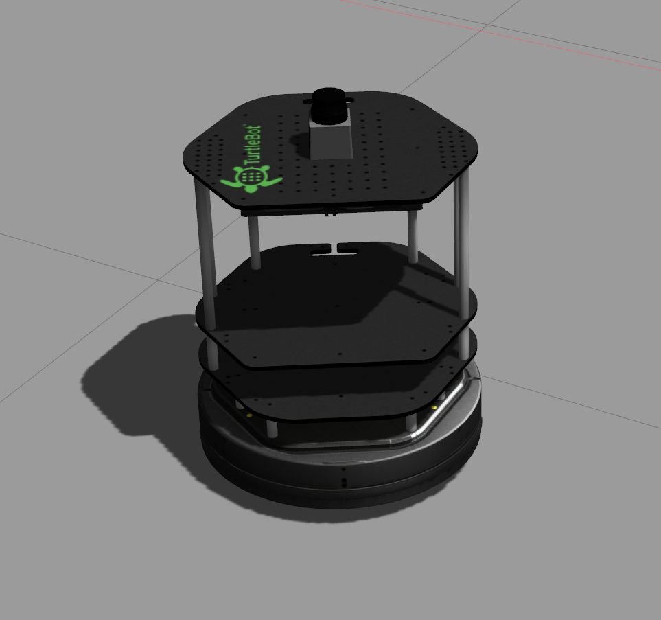
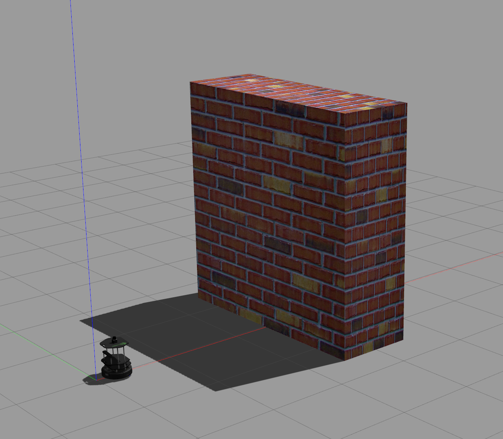
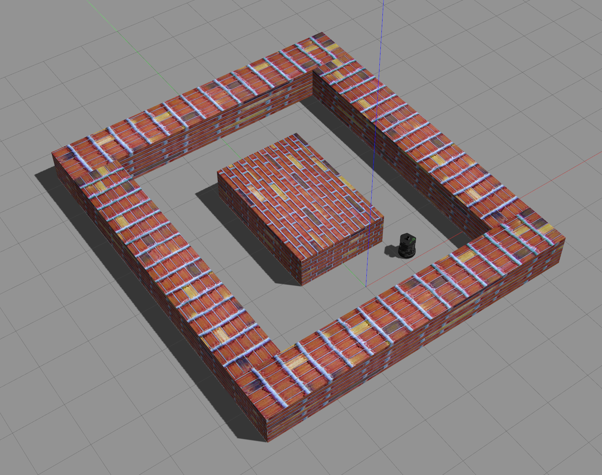
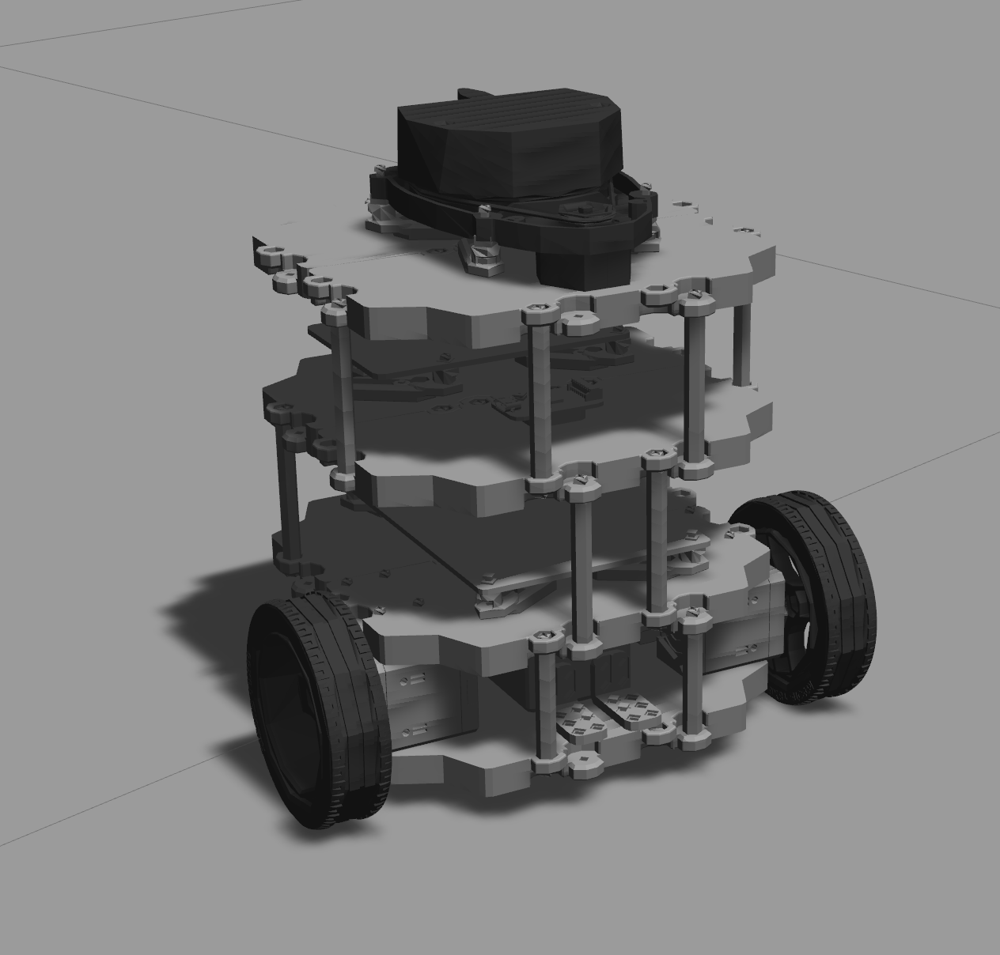
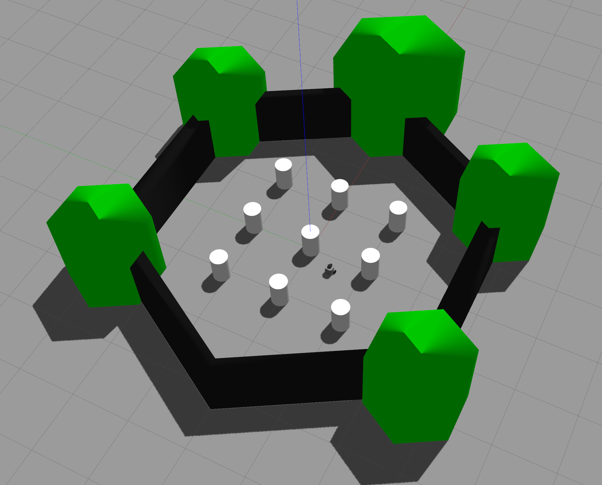

# openai_gym_ros

This package includes the openai_ros package from The Construct.

http://wiki.ros.org/openai_ros

https://www.theconstructsim.com/using-openai-ros/

## Installation instructions

### 1. Clone the repo and change some settings


```cd openai_gym_ros_ws/src```

```git clone https://github.com/MiPa12/openai_gym_ros.git```

**Specify of ros_ws_path**

turtlebot2_willow_garage_params.yaml:

```ros_ws_abspath: "/home/USER/openai_gym_ros_ws" ```


```
cd openai_gym_ros_ws
catkin_make
source devel/setup.bash
```

### 2. Run examples 


**Turtlebot2**



---

Environment: willow_garage


```roslaunch turtlebot2_training start_training_willow_garage.launch```

---

Environment: wall



```roslaunch turtlebot2_training start_training_wall.launch```

---

Environment: maze



```roslaunch turtlebot2_training start_training_maze.launch```

---

**Turtlebot3**



---

Environment: world



```roslaunch turtlebot3_training start_training_world.launch```

### 3. Create your own agent

In the openai_ros folder you have to change the following things:

1. openai_ros_common.py

If you don't want to have all robot models in your workspace you can provide a link here which will download all
your model when you lanuch the training. Afterwards you have to do a catkin_make and launch again.

```
if  package_name == "turtlebot_gazebo":

    url_git_1 = "https://bitbucket.org/theconstructcore/turtlebot.git"
    package_git = [url_git_1]
    package_to_branch_dict[url_git_1] = "kinetic-gazebo9"
```

2. robot_envs

- turtlebot2_env.py

Define path of your robot location:


```
ROSLauncher(rospackage_name="turtlebot_gazebo",
            launch_file_name="put_robot_in_world.launch",
            ros_ws_abspath=ros_ws_abspath)
```

3. task_envs

- turtlebot2_willow_garage.py

Define path of your environment location:

```
ROSLauncher(rospackage_name="turtlebot_gazebo",
            launch_file_name="willow_garage.launch",
            ros_ws_abspath=ros_ws_abspath)
```

- turtlebot2_willow_garage.yaml

- task_envs_list.py

In this list you have to set your envrionment variable:


```
elif task_env == 'MyTurtleBot2WillowGarage-v0':

    register(
        id=task_env,
        entry_point='openai_ros.task_envs.turtlebot2.turtlebot2_willow_garage:TurtleBot2WillowGarageEnv',
        max_episode_steps=max_episode_steps,
    )
    # import our training environment
    from openai_ros.task_envs.turtlebot2 import turtlebot2_willow_garage
```

Afterwards it also has to be set in the yaml file which is located in the trainings folder:

turtlebot2_willow_garage_params.yaml:

```task_and_robot_environment_name: 'MyTurtleBot2WillowGarage-v0' ```


Structure openai_ros subfolder:

```
└── openai_ros
    ├── controllers_connection.py
    ├── gazebo_connection.py
    ├── __init__.py
    ├── openai_ros_common.py
    ├── robot_envs
    │   ├── __init__.py
    │   └── turtlebot2_env.py
    ├── robot_gazebo_env.py
    └── task_envs
        ├── __init__.py
        ├── task_commons.py
        ├── task_envs_list.py
        └── turtlebot2
            ├── config
            │   └── turtlebot2_willow_garage.yaml
            ├── __init__.py
            └── turtlebot2_willow_garage.py
```

Structure of trainings folder:

```
└── training
    └── turtlebot2_training
        ├── CMakeLists.txt
        ├── config
        │   └── turtlebot2_willow_garage_params.yaml
        ├── launch
        │   └── start_training_willow_garage.launch
        ├── package.xml
        └── scripts
            ├── qlearn.py
            └── start_training.py
```


### 4. Notes

For more examples and a detail description have a look at:

http://wiki.ros.org/openai_ros/TurtleBot2%20with%20openai_ros

The original openai_ros package - version2:

https://bitbucket.org/theconstructcore/openai_ros/src/version2/

```
git clone https://bitbucket.org/theconstructcore/openai_ros.git
cd openai_ros;git checkout version2
```

More examples:

https://bitbucket.org/theconstructcore/openai_examples_projects/src/master/

```
git clone https://bitbucket.org/theconstructcore/openai_examples_projects.git
```

turtlebot repo:

https://github.com/turtlebot/turtlebot

```
git clone https://github.com/turtlebot/turtlebot.git
```

turtlebot3 repo:

https://github.com/ROBOTIS-GIT/turtlebot3

```
git clone https://github.com/ROBOTIS-GIT/turtlebot3.git
```


